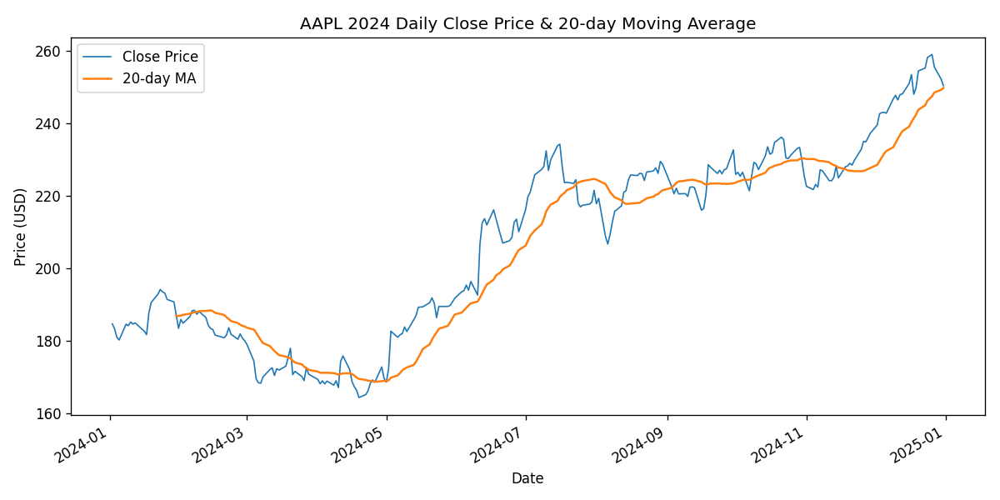
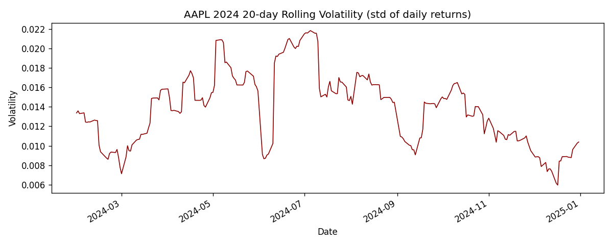
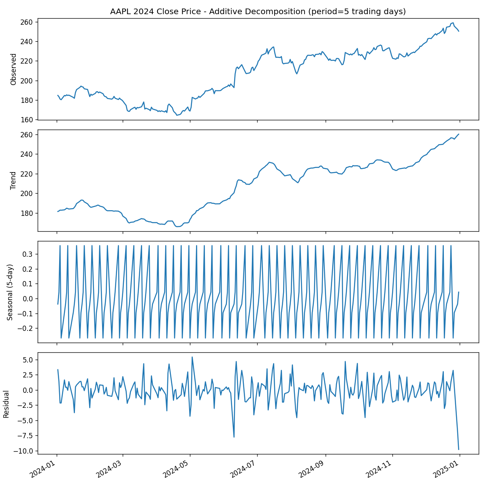

# AAPL(애플) 2024년 일별 주가 시계열 분석

## 1. 주제

애플(AAPL) 2024년 1월 2일 ~ 12월 31일 일별 종가를 시계열로 분석한다. 재무제표(매출·영업이익 등)는 분기 단위라 한 해에 4개 포인트뿐이라 "최소 100개 데이터 포인트" 요건을 충족하지 못한다. 반면 일별 종가는 거래일마다 발생해 252개 데이터 포인트를 확보할 수 있어 메인 시계열로 선정했다.

## 2. 분석 질문

1. 2024년 한 해 동안 AAPL 종가는 어떤 추세를 보였는가?
2. 20일 이동평균 대비 변동성이 특히 컸던 구간은 언제이며, 그 시점에 어떤 특징이 있는가?
3. 종가가 20일 이동평균에서 크게 벗어나는 이탈 패턴이 있는가?

## 3. 데이터 설명

- 종목: AAPL (Apple Inc., NASDAQ)
- 기간: 2024-01-02 ~ 2024-12-31 (252 거래일)
- 필드: Date, Close, High, Low, Open, Volume
- **데이터 출처**: 공개 시장 데이터 2차 가공 자료 — HuggingFace에 게시된 공개 데이터셋(https://huggingface.co/spaces/roshcheeku/STOCKBACK/blob/main/AAPL_stock_data.csv). **1차 출처(거래소·공식 시세 제공업체)가 아니라 재가공된 2차 소스라는 점을 명시한다.** SEC EDGAR(data.sec.gov)는 재무제표(XBRL) 원문은 제공하지만 일별 시장 시세는 제공하지 않아, 시세 데이터는 부득이 2차 소스를 사용했다.
- 라이선스: 원본 데이터셋 게시자가 명시한 별도 라이선스 조건 없음(공개 게시 데이터). 본 리포트는 교육 목적의 분석용으로만 사용한다.

## 4. 처리 방법

- 결측치: 확인 결과 없음 (252행 전부 값 존재)
- 이상치 기준: 전일 대비 ±5% 이상 변동을 "급변 구간" 후보로 보되, 실제로 제거하지는 않고 원인을 알 수 없는 값도 그대로 남겨 관찰 대상으로 삼는다. 이 기준으로 보면 2024-06-11~06-12 구간(하루 약 +7%, +2.9%)이 해당됨
- 파생 변수: 20일 이동평균(MA20), 일별 수익률(DailyReturn = 종가 변화율), 20일 롤링 변동성(Volatility20 = 일별 수익률의 20일 표준편차)

## 5. 시각화

### 차트 1 — 종가 & 20일 이동평균


### 차트 2 — 20일 롤링 변동성


## 6. 인사이트

1. **연간 상승 추세**: 연초(1/2) 종가 184.73에서 연말(12/31) 종가 250.42로 연간 +35.6% 상승했다. 특히 4월 중순~6월 초는 종가가 20일 이동평균을 계속 밑도는 하락 국면이었고, 6월 중순 이후로는 이동평균을 상회하는 상승 국면으로 전환됐다 — 이동평균과의 위치 관계만으로 추세 전환 시점을 식별할 수 있었다.
2. **변동성은 특정 시기에 집중**: 20일 롤링 변동성 상위 5개 구간이 전부 2024년 7월 2일~7월 9일 사이에 몰려 있다. 연중 무작위로 흩어져 있지 않고 특정 2주 구간에 집중된 점은, 이 종목의 리스크가 연중 균일하지 않고 특정 이벤트/구간에 쏠린다는 것을 시사한다(단, 그 이벤트가 무엇인지는 이 데이터만으로는 확인 불가 — 미확인).
3. **급변 구간의 존재**: 2024-06-11 하루 만에 종가가 약 +7% 뛰었고 다음날도 +2.9% 추가 상승했다. 이틀간 누적 상승폭이 연간 상승분(+35.6%)의 상당 부분을 차지할 만큼 커서, 연간 추세를 볼 때 이 이틀을 제외하고 보는 것과 포함해서 보는 것의 그림이 달라질 수 있다.
4. **연중 최고가·최저가의 위치**: 최저가(164.41)는 4월 19일, 최고가(259.02)는 12월 26일로 연초·연말이 아니라 각각 상반기 중반과 하반기 끝자락에 위치했다 — 단순히 "연초 대비 연말"만 보면 놓치는 저점·고점 시점이다.

## 7. 관찰(근거) vs 해석(가설)

**관찰(근거) — 데이터에서 직접 확인된 사실**
- 연초(1/2) 종가 184.73 → 연말(12/31) 종가 250.42, 연간 변화율 +35.6%
- 최고가 259.02(2024-12-26), 최저가 164.41(2024-04-19)
- 20일 롤링 변동성 상위 5개 구간이 모두 2024년 7월 초(7/2~7/9)에 집중됨
- 2024년 6월 11~12일 이틀 연속 큰 폭의 상승(1일 약 +7%, +2.9%)이 관찰됨
- 4월 중순부터 6월 초까지는 종가가 20일 이동평균을 밑도는 하락 추세 구간이었고, 6월 중순 이후로는 이동평균을 상회하는 상승 추세로 전환됨

**해석(가설) — 데이터만으로는 단정할 수 없는 추정**
- 6월 11~12일 급등은 시점상 애플 개발자 행사(WWDC) 관련 발표와 겹치는 것으로 보이나, 본 데이터셋에는 뉴스·이벤트 정보가 없어 원인을 단정할 수 없음(확인 필요 — 미확인)
- 7월 초 변동성 확대의 정확한 원인은 이 데이터만으로는 특정할 수 없음(미확인)
- 향후 추세가 계속 상승할 것이라 단정하지 않음 — 확실한 미래 예측은 하지 않는다는 원칙에 따름

## 8. 결론 및 한계점

**결론**: 2024년 AAPL은 4월 저점 이후 뚜렷한 상승 추세로 전환됐고, 20일 이동평균과의 이격 및 롤링 변동성 지표로 추세 전환 구간(4~5월 저점, 6월 급등, 7월 변동성 확대)을 데이터상으로 식별할 수 있었다.

**한계점**:
- 시세 데이터가 1차 공식 출처가 아닌 2차 가공 데이터셋이라 값의 정합성을 완전히 보증할 수 없음
- 1년치(252개) 데이터만 사용해 다년간 계절성이나 장기 추세는 분석하지 못함
- 시계열 분해(11번 보너스 참고)는 거래일 기준 5일 주기라는 단순 가정에 의존하며, 월별 등 다른 주기나 여러 해에 걸친 계절성은 다루지 않음

## 9. AI 사용 로그

- **사용 작업**: (1) SEC EDGAR CIK 조회 및 XBRL 재무 데이터 태그 확인, (2) 공개 주가 데이터셋 탐색 및 검증, (3) Python(pandas/matplotlib/statsmodels)으로 이동평균·변동성·시계열 분해 계산 및 시각화 코드 작성, (4) 인터랙티브 대시보드(HTML/Chart.js) 코드 작성, (5) REPORT.md 초안 작성
- **사용 이유**: 데이터 출처 탐색과 반복적인 데이터 정제·시각화·대시보드 코드 작성 시간을 줄이기 위함
- **검증 방법**: (1) 생성된 CSV의 행 수·결측치를 pandas로 직접 재검증(252행, 결측치 0건 확인), (2) 계산된 최고가/최저가/연간 변화율 수치를 원본 CSV와 대조 확인, (3) AI가 작성한 관찰 항목은 모두 코드 실행 결과값에서 직접 추출된 것만 채택하고, 데이터에 없는 원인 해석은 "미확인"으로 별도 표시, (4) 대시보드의 KPI 계산 로직(구간 변화율/최고가/최저가)을 analyze.py의 pandas 계산 결과와 수동으로 대조해 일치 확인

## 10. 실행 방법

```bash
pip install -r requirements.txt
python analyze.py       # 이동평균/변동성 계산, chart1·chart2 생성
python decompose.py     # 시계열 분해(보너스), chart3 생성
```

- `analyze.py` 실행 시 콘솔에 변동성 상위 5개 구간, 연간 요약(연초/연말 종가, 변화율, 최고/최저가)이 출력되고, `chart1_price_ma.png`, `chart2_volatility.png`, `aapl_daily_2024_processed.csv`(이동평균·변동성 컬럼 추가)가 생성된다
- `decompose.py` 실행 시 `chart3_decomposition.png`가 생성된다
- 대시보드는 `dashboard.html`을 브라우저로 열면 바로 실행됨(별도 서버 불필요, 데이터 내장)
- 개발 환경: Python 3.10 이상, 의존 라이브러리는 `requirements.txt` 참고(pandas, matplotlib, statsmodels)

## 11. 보너스 과제

### (A) 시계열 심화 — 시계열 분해

`statsmodels.tsa.seasonal_decompose`로 AAPL 종가를 추세(trend)·계절성(seasonal)·잔차(residual)로 분해했다.



- **가정**: 주가에는 기온·판매량 같은 데이터와 달리 내재적 계절성이 뚜렷하지 않다는 것을 알고 있었지만, 탐색적으로 "거래일 기준 1주(5일) 주기 패턴이 있는지"를 확인하기 위해 period=5로 가법(additive) 분해를 시도했다.
- **관찰(근거)**: 계절성분의 진폭은 -0.27~0.36 수준으로, 종가 자체의 스케일(약 165~259)에 비해 사실상 무시할 수 있는 크기다. 잔차의 표준편차(2.01)는 원계열 표준편차의 약 7.8%에 불과해, 대부분의 변동이 추세 성분으로 설명된다.
- **해석(가설)**: 요일 단위의 뚜렷한 계절성은 존재하지 않는 것으로 보인다. 이는 주가가 기업 실적·거시 이벤트 등 비주기적 요인에 더 크게 좌우된다는 일반적 통념과 일치하지만, 1년치 데이터·5일 주기 가정만으로 내린 결론이라 다른 주기(월별 등)나 더 긴 기간에서는 다를 수 있음(미확인).

### (B) 분석 결과 서비스화 — 인터랙티브 대시보드

기간(시작일/종료일 직접 입력 또는 "최근 1/3/6개월 · 전체" 버튼)을 바꿔가며 종가·이동평균·변동성을 탐색할 수 있는 대시보드를 만들어 배포했다.

- **배포 URL**: https://claude.ai/artifact/6wzHacJJpDY4rAprDQwLXT
- 기간을 바꾸면 KPI 카드(구간 데이터 포인트 수, 변화율, 최고가/최저가, 평균 변동성)와 두 차트가 즉시 다시 계산·렌더링된다
- 데이터는 페이지 안에 내장되어 있어 별도 서버 없이 `dashboard.html` 파일을 여는 것만으로도 동일하게 동작한다(로컬 실행 대안)

